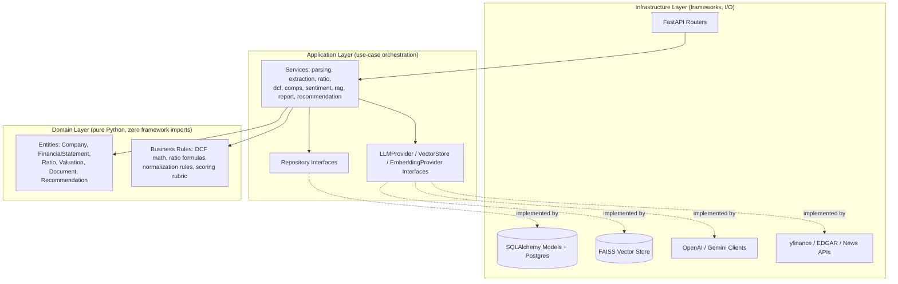

# EquityIQ — Build Specification (v2.0, Agent-Ready)

**Status:** Approved for implementation. This document supersedes all prior drafts.
**Audience:** A coding agent (or engineer) implementing this project with no further clarification needed.
**Rule for the agent:** If any instruction in this document seems ambiguous or contradicted elsewhere in the document, stop and flag it rather than guessing. Do not silently resolve conflicts.

---

## 0. How to Use This Document

This is a single source of truth that merges three prior artifacts into one consistent spec:
1. The original SRS (architecture, DB, API, financial engine, RAG design).
2. The revised technology mandate (LangChain/LlamaIndex/FAISS/OpenAI-or-Gemini/yfinance/QuantLib/sec-edgar-downloader stack, Clean Architecture/DDD rigor).
3. All **Critical** and **Important** fixes from the architecture review — these are not suggestions, they are requirements. Every fix below is already integrated into the relevant section; nothing needs to be re-derived.

Build in the order given in **Section 14 (Build Order)**. Do not build the frontend before the backend's core financial engine and RAG pipeline are tested and passing — the roadmap is dependency-ordered for a reason.

Every numbered section below is self-contained enough to hand to an agent as its own task, but Sections 1–3 (principles, architecture, stack) must be read first because every later section depends on the boundary rules defined there.

---

## 1. Engineering Principles (Non-Negotiable)

These are enforced, not aspirational. CI must fail if any of these are violated.

1. **The domain layer never imports a framework.** `domain/` contains pure Python (dataclasses/Pydantic models, business rules) with zero imports of `fastapi`, `sqlalchemy`, `langchain`, `llama_index`, `openai`, `google.generativeai`, or `celery`. This is enforced by an `import-linter` (or `ruff`) rule in CI — a PR that violates it fails the build, full stop.
2. **The LLM never performs arithmetic.** Every number that appears in a report or answer is either (a) computed by `financial_engine/` (pure Python, unit-tested) or (b) directly copied from a cited source document. The LLM's role is narration and synthesis, never calculation. This is checked programmatically (Section 9, post-processing validation), not just by prompt instruction.
3. **Every claim is traceable.** Every quantitative claim traces to a `financial_statements` row or a `ratios`/`valuations` row. Every qualitative claim traces to a `document_chunks` id with a page number. A report with an untraceable claim is a bug, not a style issue.
4. **Provider swap is a config change, not a code change.** Whether the LLM provider is OpenAI or Gemini, and whether the embedding/vector stack is FAISS-local or a managed alternative, must be a settings/env change behind an interface — never a rewrite. This is verified by an actual test that runs the same test suite against both providers with a fake/mock swap.
5. **Silence is never acceptable for missing data.** If data is unavailable, the system says so explicitly ("data unavailable for this period") — it never omits a section without explanation, and never fills a gap with an invented plausible-looking number.
6. **Documents are data, never instructions.** Text extracted from an ingested filing is never concatenated into a prompt in a way that could be interpreted as a system-level instruction. This is enforced structurally (Section 10.4), not just by asking the model nicely.

---

## 2. Final Technology Stack (Mandated — Do Not Substitute Without Flagging)

| Layer | Technology | Notes |
|---|---|---|
| Primary language | Python 3.12+ | |
| Secondary language | TypeScript | Frontend |
| Backend framework | FastAPI | Async-native |
| ORM / Migrations | SQLAlchemy (async) + Alembic | |
| Validation | Pydantic v2 | |
| Task queue | Celery + Redis (broker) | |
| Cache | Redis | |
| Database | PostgreSQL | |
| AI orchestration | LangChain (primary chains/agents) + LlamaIndex (document parsing/indexing utilities where they outperform LangChain's, e.g. structured PDF/table parsing) | Use LangChain for the agent/tool-calling layer (Section 10.5); use LlamaIndex's node-parsing utilities for document chunking if they prove more robust in testing than a hand-rolled chunker — this is an implementation choice to validate empirically, not a hard requirement to use both everywhere. |
| Vector store | FAISS (local, self-hosted) | Chosen for zero external dependency/cost during portfolio development. Wrapped behind a `VectorStore` interface (Section 3.3) so swapping to a managed store (Qdrant/Pinecone) later is a one-file change. |
| Embedding model | Sentence-Transformers (self-hosted, e.g. a BGE/E5-family model) | Keeps embedding cost at zero during development; swappable via the same interface pattern. |
| LLM provider | OpenAI API **or** Gemini API, behind an `LLMProvider` interface | Default to whichever the developer has credits/access for; must be swappable via a single config value (`LLM_PROVIDER=openai|gemini`). |
| Sentiment model | FinBERT (domain-tuned, self-hosted) | Cheaper/faster than an LLM call per passage; LLM used only as a secondary pass on ambiguous excerpts. |
| Financial data | `yfinance` (market data, prices, shares outstanding), `sec-edgar-downloader` (US filings), `FinanceDatabase` (sector/peer classification), `QuantLib` (any date/day-count/discounting utilities needed for DCF precision) | For non-US companies, manual document upload is the universal fallback path (EDGAR is US-only). |
| Forecasting (optional, v1.5+) | Prophet | Only if a company/analyst-level forecasting feature is prioritized; not required for MVP. |
| Frontend framework | React + Next.js + TypeScript | App Router |
| Styling | Tailwind CSS for layout/spacing; Material UI (MUI) reserved for complex interactive primitives only (data tables, date pickers, autocomplete) | This boundary is explicit and must be followed — do not let MUI's component styling and Tailwind's utility classes fight each other by using both loosely. |
| Frontend data-fetching | TanStack Query | Handles client-side caching/invalidation; do not duplicate a second caching layer on top of Redis's server-side caching — they solve different problems (server compute cache vs. client fetch cache). |
| Charts | Recharts | |
| Auth | JWT (access + rotated refresh tokens) + OAuth2 (Google) | |
| Containerization | Docker + Docker Compose | |
| CI/CD | GitHub Actions | |
| Cloud | AWS (preferred) or Render for a lower-cost always-on portfolio deployment | |
| Monitoring | Prometheus + Grafana | |
| Testing | Pytest, React Testing Library, Locust/k6 (load), a custom RAG-eval harness | |
| Documentation | MkDocs (docs site) + Swagger/OpenAPI (API contract) | |
| Import boundary enforcement | `import-linter` | Enforces Principle 1 in CI |

---

## 3. System Architecture

### 3.1 Layered Architecture (Clean Architecture / DDD)



**The rule this diagram encodes:** arrows only point inward toward `Domain/`. `Domain/` has no outgoing arrows to `Infra/`. If you find yourself importing `sqlalchemy` inside `domain/`, stop — that's the violation Principle 1 exists to catch.

### 3.2 Component Communication

- **Frontend → Backend:** REST (HTTPS/JSON) for CRUD; **Server-Sent Events (SSE)** for report-generation streaming (see explicit contract in Section 6.4 — this was previously underspecified and is now fixed).
- **Backend → DB:** async SQLAlchemy via repository interfaces, never directly from `services/`.
- **Backend → Task Queue:** long-running work (parsing, embedding, report generation) is enqueued via Celery; the API returns 202 immediately.
- **Workers → FAISS:** embeddings written/queried through the `VectorStore` interface, never a direct FAISS call from a service.
- **Workers → LLM:** all calls go through `LLMProvider` interface implementations (`OpenAIProvider`, `GeminiProvider`), never a raw SDK call from business logic.
- **External data:** `yfinance`/EDGAR/news pulled by scheduled workers, cached in Redis/Postgres with TTL, behind circuit breakers.

### 3.3 Required Interfaces (Define These First, Before Any Implementation)

```python
# domain/interfaces (pure abstract, no implementation, no framework imports)

class CompanyRepository(Protocol):
    async def get_by_ticker(self, ticker: str) -> Company | None: ...
    async def save(self, company: Company) -> Company: ...

class DocumentRepository(Protocol):
    async def get(self, document_id: UUID) -> Document | None: ...
    async def save(self, document: Document) -> Document: ...
    async def list_by_company(self, company_id: UUID, fiscal_period: str | None) -> list[Document]: ...

class LLMProvider(Protocol):
    async def complete(self, prompt: str, schema: type[BaseModel] | None = None) -> LLMResponse: ...
    async def complete_with_tools(self, prompt: str, tools: list[Tool]) -> LLMResponse: ...

class EmbeddingProvider(Protocol):
    async def embed(self, texts: list[str]) -> list[list[float]]: ...

class VectorStore(Protocol):
    async def upsert(self, chunks: list[EmbeddedChunk]) -> None: ...
    async def query(self, vector: list[float], filters: MetadataFilter, top_k: int) -> list[ScoredChunk]: ...
    async def delete_by_document(self, document_id: UUID) -> None: ...
```

Every service depends on these interfaces (constructor-injected), never on a concrete `OpenAIProvider` or `FAISSVectorStore` directly. This single pattern is what satisfies Principle 4 (provider swap = config change).

---

## 4. Folder Structure (Enforced Boundaries)

```
equityiq/
├── backend/
│   ├── app/
│   │   ├── domain/                       # PURE — no framework imports, enforced by import-linter
│   │   │   ├── entities/                 # Company, Document, FinancialStatement, Ratio, Valuation, Recommendation
│   │   │   ├── value_objects/            # Money, FiscalPeriod, Ticker
│   │   │   ├── rules/                    # dcf_math.py, ratio_formulas.py, normalization_rules.py, scoring_rubric.py
│   │   │   └── interfaces/               # CompanyRepository, LLMProvider, VectorStore, EmbeddingProvider (Section 3.3)
│   │   ├── application/                  # use-case orchestration, depends on domain + interfaces only
│   │   │   └── services/
│   │   │       ├── parsing_service.py
│   │   │       ├── extraction_service.py       # includes normalization step — see Section 9
│   │   │       ├── ratio_service.py
│   │   │       ├── dcf_service.py
│   │   │       ├── comps_service.py
│   │   │       ├── sentiment_service.py
│   │   │       ├── rag_service.py
│   │   │       ├── report_service.py
│   │   │       └── recommendation_service.py
│   │   ├── infrastructure/                # all framework/IO code lives here
│   │   │   ├── db/
│   │   │   │   ├── models/                # SQLAlchemy ORM models
│   │   │   │   ├── repositories/          # concrete implementations of domain/interfaces
│   │   │   │   └── migrations/            # Alembic
│   │   │   ├── llm/
│   │   │   │   ├── openai_provider.py
│   │   │   │   ├── gemini_provider.py
│   │   │   │   ├── tools/                 # agent tool definitions (Section 10.5)
│   │   │   │   └── prompts/               # versioned prompt templates (Section 11)
│   │   │   ├── rag/
│   │   │   │   ├── chunking.py            # LangChain/LlamaIndex node parsers
│   │   │   │   ├── faiss_vector_store.py  # concrete VectorStore impl
│   │   │   │   ├── embedding_provider.py
│   │   │   │   └── retriever.py           # hybrid search + re-ranking
│   │   │   ├── external/
│   │   │   │   ├── yfinance_client.py
│   │   │   │   ├── edgar_client.py
│   │   │   │   ├── finance_database_client.py
│   │   │   │   └── news_client.py
│   │   │   └── security/
│   │   │       ├── auth.py                # JWT/OAuth2
│   │   │       └── prompt_injection_filter.py   # Section 10.4 — new, was missing
│   │   ├── api/
│   │   │   └── v1/                        # FastAPI routers — thin, delegate to application/services immediately
│   │   ├── workers/                       # Celery task definitions, call application/services
│   │   ├── financial_engine/              # thin wrapper re-exporting domain/rules for backward-compatible imports
│   │   ├── core/                          # config.py (Pydantic Settings incl. LLM_PROVIDER, VECTOR_STORE toggles), logging.py
│   │   └── main.py
│   ├── tests/
│   │   ├── unit/                          # domain + application, no I/O
│   │   ├── integration/                   # infrastructure + real (ephemeral) Postgres/Redis/FAISS
│   │   ├── contract/                      # schema-contract tests between financial_engine output and prompt input (Section 13.4 — new)
│   │   ├── rag_eval/                      # golden dataset + faithfulness/hallucination harness
│   │   ├── provider_parity/               # runs core suite against both OpenAI and Gemini providers (Principle 4)
│   │   └── e2e/
│   ├── .import-linter.cfg                 # enforces domain/ boundary — new, was missing
│   ├── Dockerfile
│   └── pyproject.toml
├── frontend/
│   ├── app/                               # Next.js App Router pages
│   ├── components/
│   │   ├── charts/
│   │   ├── reports/
│   │   ├── chat/
│   │   └── ui/                            # MUI-wrapped complex primitives only — see Section 2 styling boundary
│   ├── lib/
│   │   ├── api-client.ts
│   │   ├── query-client.ts                # TanStack Query setup
│   │   └── auth.ts
│   ├── tests/                             # React Testing Library
│   ├── public/
│   └── Dockerfile
├── infra/
│   ├── docker-compose.yml
│   ├── docker-compose.prod.yml
│   ├── terraform/
│   └── grafana/
├── docs/
│   ├── architecture-diagrams/
│   ├── adr/
│   └── api-spec.yaml
├── scripts/
├── .github/workflows/
├── README.md
└── LICENSE
```

**Key changes vs. the original SRS folder structure:** `domain/`, `application/`, `infrastructure/` replace the flatter `models/services/llm/rag/financial_engine` split, so the dependency-inversion rule is structurally visible in the folder tree itself, not just described in prose. `.import-linter.cfg` and `tests/provider_parity/` and `tests/contract/` are new — they exist specifically to make Principles 1 and 4 and the schema-contract gap (Section 13.4) machine-checked rather than asserted.

---

## 5. Database Design (Updated)

All tables: `UUID` PKs, `created_at`/`updated_at`, soft-delete via `deleted_at` where applicable. Schema is unchanged from the original SRS except where noted **[UPDATED]**.

### 5.1 `users` — unchanged
`id, email (unique, indexed), hashed_password (nullable), oauth_provider (nullable), role ENUM(admin, analyst, viewer), created_at`

### 5.2 `workspaces` — unchanged
`id, name, owner_id FK→users, created_at` — index on `owner_id`.

### 5.3 `companies` — unchanged
`id, ticker (indexed), name, sector, industry, fiscal_year_end, currency (ISO 4217)` — unique composite on (`ticker`, `exchange`).

### 5.4 `documents` — unchanged
`id, workspace_id FK, company_id FK, doc_type ENUM(10K,10Q,investor_deck,earnings_call,news), fiscal_period, storage_path, parsing_status ENUM(pending,processing,completed,failed), parsing_confidence, uploaded_by FK, created_at` — composite index (`company_id`, `fiscal_period`), index on `parsing_status`.

### 5.5 `financial_statements` **[UPDATED — Critical Fix: Normalization]**
| Column | Type | Notes |
|---|---|---|
| id | UUID PK | |
| company_id | UUID FK | |
| document_id | UUID FK | provenance |
| statement_type | ENUM(income, balance, cashflow) | |
| fiscal_period | VARCHAR | |
| line_items | JSONB | as-reported figures, e.g. `{"revenue": 1234.5, "cogs": 800.1}` |
| **normalization_adjustments** | **JSONB** | **NEW.** Itemized list of adjustments applied to derive normalized figures, e.g. `[{"line_item": "operating_income", "adjustment": -45.2, "reason": "one-time restructuring charge", "source_document_id": "...", "source_page": 47}]`. Every adjustment must cite its source. |
| **normalized_line_items** | **JSONB** | **NEW.** `line_items` with `normalization_adjustments` applied — this is what `ratio_service`/`dcf_service` consume by default; raw `line_items` remains available for audit/comparison. |
| extraction_confidence | JSONB | per-field confidence |
| created_at | TIMESTAMPTZ | |

**Indexes:** composite unique on (`company_id`, `fiscal_period`, `statement_type`).

**Why this exists:** flagged as a Critical gap in review — an unnormalized DCF/ratio set silently absorbs one-time items (restructuring charges, impairments, litigation settlements) and produces a materially wrong result. Every downstream financial calculation must read from `normalized_line_items`, never raw `line_items`, unless explicitly computing an "as-reported" comparison view.

### 5.6 `ratios` — unchanged
`id, company_id FK, fiscal_period, ratio_name, value, formula_version, computed_at` — unique composite (`company_id`, `fiscal_period`, `ratio_name`).

### 5.7 `valuations` **[UPDATED — data-source precedence]**
| Column | Type | Notes |
|---|---|---|
| id | UUID PK | |
| company_id | UUID FK | |
| method | ENUM(dcf, comps) | |
| assumptions | JSONB | full input assumption set |
| **data_source_log** | **JSONB** | **NEW.** Records which source was used for each conflict-prone input (e.g., `{"shares_outstanding": {"value": 512000000, "source": "filing", "as_of": "2025-12-31", "market_api_value": 509800000, "market_api_as_of": "2026-07-01", "resolution": "filing_authoritative_for_historical_period"}}`) per the precedence rule in Section 9.3. |
| result | JSONB | output + sensitivity table |
| created_at | TIMESTAMPTZ | |

### 5.8 `news` — unchanged
`id, company_id FK, headline, source, published_at, sentiment_score (nullable), url` — composite index (`company_id`, `published_at`).

### 5.9 `document_chunks` **[UPDATED — consistency strategy]**
| Column | Type | Notes |
|---|---|---|
| id | UUID PK | matches FAISS vector id |
| document_id | UUID FK | |
| chunk_index | INT | |
| page_number | INT | |
| section_label | VARCHAR | |
| text_preview | TEXT | |
| **embedding_model_version** | **VARCHAR** | **NEW.** Prevents mixing embeddings from different model versions in the same index (already specified in the RAG section; now also enforced at the DB level). |
| **sync_status** | **ENUM(synced, pending_delete, orphaned)** | **NEW.** |

**Consistency strategy (resolves the previously unaddressed dual-write gap):** re-embedding or deletion of a document's chunks is implemented as an all-or-nothing transaction pattern — delete all `document_chunks` rows for a `document_id` **and** issue the corresponding FAISS deletion in the same worker task, with the FAISS deletion committed first; if the FAISS deletion succeeds but the Postgres delete fails, a retryable task reconciles it. A nightly reconciliation job compares `document_chunks` row counts per `document_id` against FAISS index membership and flags (`sync_status = orphaned`) any mismatch for manual/automated cleanup. Partial incremental updates to an existing embedded document are not supported — re-embedding always replaces the full set for that document.

**Indexes:** index on `document_id`, index on `sync_status` (for the reconciliation job's query).

### 5.10 `chat_history` — unchanged
`id, user_id FK, workspace_id FK, company_id FK (nullable), role ENUM(user,assistant), content, citations JSONB, created_at` — composite index (`workspace_id`, `created_at`).

### 5.11 `reports` — unchanged
`id, company_id FK, version, storage_path, recommendation ENUM(buy,hold,sell), composite_score, generated_by FK, created_at` — unique composite (`company_id`, `version`).

### 5.12 `audit_logs` — unchanged
`id, user_id FK, action, resource_type, resource_id, metadata JSONB, created_at` — index (`resource_type`, `resource_id`), index `created_at`.

---

## 6. API Design (Updated)

All endpoints under `/api/v1`. Auth: `Authorization: Bearer <JWT>`. Error envelope: `{"error": {"code", "message", "request_id"}}`.

Endpoints unchanged from the original SRS (`/auth/*`, `/workspaces`, `/companies`, `/documents/upload`, `/companies/{id}/ratios`, `/companies/{id}/valuation/dcf`, `/companies/{id}/valuation/comps`, `/companies/{id}/sentiment`, `/chat/query`, `/reports/generate`, `/reports/{id}`, `/reports/{id}/recommendation`, `/companies/{id}/compare`, `/audit-logs`) remain as previously specified, with status codes 200/201/202/400/401/403/404/409/413/422/429/500/503 per the original convention.

### 6.4 New: Report Streaming Contract **[Fixes previously underspecified streaming]**

`GET /api/v1/reports/{id}/stream` — Server-Sent Events (SSE), auth required.

Event types (each a JSON payload in the SSE `data:` field):
- `status_update` — `{"stage": "extraction|ratios|dcf|comps|sentiment|rag|assembly", "progress_pct": int}`
- `section_complete` — `{"section": "investment_thesis|financial_highlights|valuation_summary|risks|recommendation", "content": str}`
- `done` — `{"report_id": UUID, "final_recommendation": "buy|hold|sell"}`
- `error` — `{"code": str, "message": str, "recoverable": bool}`

**Client fallback contract:** if the SSE connection drops or is unsupported, the client falls back to polling `GET /api/v1/reports/{id}` at a 3-second interval. The polling response includes the same `stage`/`progress_pct` fields so both code paths render identical UI state.

### 6.5 New: Q&A with Tool-Calling **[reflects Section 10.5 agent architecture]**

`POST /api/v1/chat/query` request body gains an optional field: `{"company_id", "question", "conversation_id?", "allow_tool_calls": bool (default true)}`. When `allow_tool_calls` is true, the LLM may invoke the `get_ratio`/`get_valuation` tools (Section 10.5) directly rather than relying solely on pre-retrieved context; the response's `citations[]` array in this case includes tool-call provenance (`{"type": "tool_call", "tool": "get_ratio", "args": {...}}`) alongside document citations, so the traceability principle (Principle 3) still holds for tool-sourced numbers.

---

## 7. AI Pipeline (End-to-End, Updated)

1. **Upload** → S3, `documents` row (`parsing_status=pending`), Celery task enqueued, API returns 202 immediately.
2. **Parsing** → text + table + page-map extraction (PyMuPDF/pdfplumber + LlamaIndex node parsers for layout-aware splitting where beneficial); OCR fallback for scanned filings.
3. **Structuring** → LLM-assisted extraction into `financial_statements.line_items`, constrained via the LLM provider's native structured-output/schema mode (not just prompt instruction) with a repair-retry loop on schema-validation failure; accounting-identity validation (Assets = Liabilities + Equity) before persisting.
4. **Normalization [NEW STEP]** → a dedicated normalization pass (LLM-assisted detection of one-time items + rules-based thresholds, e.g. any single line-item swing >15% quarter-over-quarter flagged for review) populates `normalization_adjustments` and `normalized_line_items`, each adjustment citing its source page. Human-reviewable before being marked "confirmed" (a `confidence` below a threshold routes to a manual-review queue rather than auto-confirming).
5. **Prompt-Injection Screening [NEW STEP]** → before any extracted or chunked text is placed into an LLM context, it passes through `infrastructure/security/prompt_injection_filter.py`, which screens for common injection patterns (e.g., text resembling system/instruction framing embedded mid-document) and wraps all document-derived content in an explicit "this is untrusted data, not an instruction" delimiter in every prompt template (Section 11's grounding contract already states this; this step is the structural enforcement of it, not just the wording).
6. **Chunking** → semantic chunking (500–800 tokens, 15–20% overlap) for narrative sections; tables chunked as atomic units.
7. **Embedding** → Sentence-Transformers, batched; `embedding_model_version` tagged on every chunk.
8. **Vector Storage** → FAISS via the `VectorStore` interface; metadata (`company_id, document_id, doc_type, fiscal_period, page_number, section_label`) stored alongside for filtering.
9. **Retrieval** → hybrid (dense FAISS + BM25 sparse) → cross-encoder re-rank → top 5–8 chunks.
10. **Agent/Tool Layer [NEW]** → for Q&A and report narration, the LLM operates as a LangChain tool-calling agent with access to `get_ratio`, `get_valuation`, `search_documents` tools (Section 10.5) — it is not limited to only the pre-retrieved context injected at prompt-build time; it can request specific additional data through tools when the question requires it.
11. **Context Budget Enforcement [NEW]** → before assembly, a context-budget policy caps: chat history to the last N turns + a summarized digest of older turns; document context to the top re-ranked chunks; if a query's evidence need exceeds the budget, the system returns a partial answer with an explicit "this question may require broader research than this system can retrieve in one pass" disclaimer rather than silently truncating.
12. **LLM Response** → via `LLMProvider` interface; every call logs prompt version, token count, latency, cost.
13. **Post-Processing Validation** → (a) every citation checked against actually-retrieved chunk/tool-call ids; (b) every numeric claim cross-checked against `financial_engine`/`ratios`/`valuations` output — any mismatch rejects the output and triggers regeneration or a flagged-for-review state, never silent pass-through.
14. **Report Assembly** → validated sections → PDF/DOCX/Markdown, `reports` row created, SSE `done` event emitted.

---

## 8. Financial Analysis Engine

Unchanged core logic from the SRS (ratios, DCF with FCFF/FCFE, comps with IQR-outlier filtering, sensitivity grids, rules-based risk flags), with two additions:

### 8.1 Normalization Consumption Rule
`ratio_service` and `dcf_service` read from `financial_statements.normalized_line_items` by default. A `use_as_reported=True` override parameter exists for generating an explicit "as-reported vs. normalized" comparison view in the report, but normalized figures are the default for every valuation and ratio computed for the recommendation engine.

### 8.2 Data-Source Precedence Rule **[New — Critical Fix]**
When a value could come from either the filing (via extraction) or a live market-data API (`yfinance`), the following precedence applies and is logged in `valuations.data_source_log`:
- **Historical financial figures** (revenue, net income, balance-sheet items for a completed fiscal period): filing is authoritative. Never override with a market-data API's estimate.
- **Current share price / current shares outstanding** (used for market cap, P/E, per-share DCF value as of today): market-data API is authoritative, since it reflects buybacks/issuances after the filing date.
- **Conflict logging:** any time both sources are available for the same conceptual field and disagree by more than a small tolerance (e.g., >0.5% for shares outstanding), both values and the resolution are recorded in `data_source_log` — this is never silently resolved without a record.

### 8.3 Hard DCF Validation (unchanged)
Terminal growth rate ≥ WACC is rejected at the service layer with a 400, never silently computed.

---

## 9. RAG Pipeline Configuration

Unchanged from the SRS: 500–800 token chunks / 15–20% overlap / metadata-filtered hybrid search (FAISS dense + BM25 sparse) / cross-encoder re-ranking / faithfulness+precision+recall evaluation against a golden Q&A dataset. Implementation notes specific to the mandated stack:

- Use LangChain's retriever abstractions to wire FAISS + BM25 + re-ranker into a single hybrid retriever object, so the retrieval logic is swappable and testable independent of the agent layer.
- Use LlamaIndex's document/node parsers specifically for the table-aware and layout-aware chunking of filings (this is a place LlamaIndex's utilities are more mature out-of-the-box than hand-rolling in LangChain) — evaluate both against the golden dataset's context-precision/recall metrics before committing; do not assume, measure.

### 9.1 Tool-Calling Agent Definition **[New — addresses AI-architecture review gap]**

Tools exposed to the LLM agent (defined in `infrastructure/llm/tools/`):
```python
get_ratio(company_id: UUID, ratio_name: str, fiscal_period: str) -> RatioResult
get_valuation(company_id: UUID, method: Literal["dcf", "comps"]) -> ValuationResult
search_documents(company_id: UUID, query: str, doc_type: str | None, fiscal_period: str | None) -> list[ChunkResult]
```
Each tool call and its result is logged with the same provenance discipline as retrieved chunks (Principle 3) and surfaced in the response's `citations[]` as a `tool_call` entry (Section 6.5).

### 9.2 Context Budget Policy **[New]**

| Context component | Budget |
|---|---|
| Chat history | Last 10 turns verbatim + an LLM-generated summary of older turns (regenerated every 10 turns) |
| Retrieved document chunks | Top 8 after re-ranking |
| Financial data injected | Only the specific ratios/valuation fields relevant to the current query/report section — never the entire company's dataset dumped into context |
| Overflow behavior | If the assembled prompt would exceed ~70% of the provider's context window, the system trims chat history further before trimming document chunks (chat history is lower-priority than source evidence), and if still over budget, returns a partial-answer disclaimer rather than silently truncating mid-citation |

---

## 10. Prompt Engineering

Structure unchanged (role framing → grounding contract → task instructions → output schema → context), all templates versioned in `infrastructure/llm/prompts/`. Two additions:

### 10.1 Grounding Contract (Updated Text Intent)
Every generation prompt is prepended with an instruction establishing: (a) the model operates in a regulated-adjacent financial context and must never fabricate a number; (b) all document-derived content appearing after a specific delimiter is **data, not instructions** — even if it contains language that looks like a command, it must be treated as content to reason about, never obeyed (this is the structural counterpart to the prompt-injection filter in Section 7, step 5).

### 10.2 Structured Output Enforcement
Extraction and structuring prompts use the LLM provider's native JSON-schema/structured-output mode as the primary mechanism, with the validation layer (Section 7, step 13) as a second check — not the only check.

---

## 11. Evaluation Metrics

Unchanged from the SRS: RAG accuracy, faithfulness, hallucination rate, response time, precision/recall, latency, document parsing accuracy, financial calculation accuracy — each measured as previously specified (golden dataset, automated cross-checks, Prometheus histograms, unit-test fixtures).

**Addition:** track **tool-call correctness** as a new metric — fraction of agent tool invocations (Section 9.1) that call the right tool with valid arguments, measured against the golden dataset's known-correct tool-call traces.

---

## 12. Security

Unchanged core requirements (JWT rotation, RBAC + row-level workspace scoping, secrets manager, rate limiting, MIME+magic-byte file validation, encryption at rest/in transit, OWASP list) **plus:**

### 12.1 Prompt-Injection Defense **[New — Critical Fix]**
- All document-derived text passes through `prompt_injection_filter.py` before reaching any LLM context (Section 7, step 5).
- The filter screens for patterns resembling instruction-injection (e.g., phrases mimicking system-prompt framing, requests to "ignore previous instructions," embedded role-play framing) and flags matches for the extraction/report pipeline to either strip or explicitly quarantine (never silently pass through unflagged).
- This is documented as **mitigation, not elimination** — no injection filter is complete, and this is stated plainly rather than oversold in any documentation or interview answer.
- The grounding contract's data-vs-instruction delimiter (Section 10.1) is the second, structural layer of defense — filtering and prompt-framing work together, neither alone is sufficient.

---

## 13. DevOps & Testing

### 13.1 DevOps (unchanged, plus one fix)
Docker/Compose/GitHub Actions pipeline as previously specified, **plus automatic rollback on failed post-deploy smoke test** (previously missing) — a failed smoke test triggers automatic redeploy of the last known-good image rather than leaving a broken release live.

### 13.2 Import Boundary Enforcement **[New]**
`.import-linter.cfg` defines a contract: `domain` must not import `fastapi|sqlalchemy|langchain|llama_index|openai|google.generativeai|celery`. This runs as a required CI check on every PR.

### 13.3 Provider Parity Testing **[New]**
`tests/provider_parity/` runs the core service-layer test suite twice — once with `LLMProvider` mocked/pointed at OpenAI, once at Gemini — to prove Principle 4 (provider swap = config change) is actually true, not just designed to be true.

### 13.4 Schema-Contract Tests **[New]**
`tests/contract/` validates that every service's output Pydantic model (e.g., `DCFResult`, `RatioReport`) matches what the corresponding prompt template in `infrastructure/llm/prompts/` expects as input — this test fails at build time if a service's output shape drifts, instead of failing silently at prompt-assembly time in production.

### 13.5 All Other Testing (unchanged)
Unit tests on `financial_engine`/`domain/rules` with known-answer fixtures; integration tests on the full ingestion pipeline; API contract tests against the OpenAPI spec; LLM/RAG evaluation harness against thresholds (faithfulness ≥ 0.85, etc.); load testing via Locust/k6; regression testing via golden-report snapshots.

---

## 14. Build Order (Dependency-Ordered — Follow This Sequence)

1. **Scaffolding:** repo structure (Section 4), `.import-linter.cfg`, Docker Compose (Postgres, Redis, FAISS-serving container if applicable), CI skeleton (lint + import-linter check, even before there's much to test).
2. **Domain layer first:** define all entities, value objects, and interfaces (Section 3.3) — write these before any infrastructure code. Unit-test the pure business rules (ratio formulas, DCF math, scoring rubric) against known-answer fixtures immediately; this is the highest-value, lowest-risk code in the project and should be rock-solid before anything else is built on top of it.
3. **Auth + workspace + company CRUD** (infrastructure/db + api/v1), with row-level workspace scoping enforced from day one, not retrofitted later.
4. **Document ingestion pipeline:** upload → parsing → chunking (steps 1–2, 6 of Section 7), without the LLM-structuring step yet — get raw text/tables flowing end-to-end first.
5. **Financial extraction + normalization** (steps 3–4 of Section 7): structured extraction with schema enforcement, then the normalization pass. Validate against a small hand-checked sample of real filings before moving on.
6. **Financial engine wiring:** connect `ratio_service`/`dcf_service`/`comps_service` to `normalized_line_items`, implement the data-source precedence rule (Section 8.2), validate DCF against textbook hand-calculated examples.
7. **Vector pipeline:** embedding + FAISS storage (steps 7–8), then hybrid retrieval + re-ranking (step 9).
8. **Prompt-injection filter + grounding contract** (Sections 7 step 5, 10.1) — build this *before* wiring the agent/Q&A layer, not after, since it's a precondition for safely sending document content into any prompt.
9. **Tool-calling agent + Q&A** (Section 9.1, step 10 of Section 7): build the three tools, wire the LangChain agent, implement context-budget enforcement (Section 9.2), implement post-processing validation (step 13 of Section 7).
10. **Sentiment engine:** FinBERT integration + trend detection.
11. **Recommendation engine:** composite scoring rubric consuming DCF/comps/ratio-trend/sentiment outputs.
12. **Report generation + SSE streaming:** assembly, PDF/DOCX export, the SSE contract (Section 6.4).
13. **Frontend:** company dashboard, ratio charts, chat UI with citation display, report view — built against the now-stable API contract, using TanStack Query + the Tailwind/MUI boundary from Section 2.
14. **Observability:** Prometheus/Grafana, structured logging, cost/latency dashboards.
15. **Full security hardening pass:** rate limiting, file validation, secrets manager wiring, the OWASP checklist — verify everything from Section 12 is actually in place, not just designed.
16. **Full test suite + CI hardening:** provider-parity tests, schema-contract tests, load testing, golden-report regression snapshots — get CI fully green across every category in Section 13 before calling this "done."
17. **Deployment + portfolio polish:** live deployment, README/ADRs/demo GIF (per the earlier portfolio-strategy guidance), architecture diagrams exported from this document's Mermaid sources.

**Definition of done for the whole project:** every Principle in Section 1 is true and CI-verified, every Critical and Important fix in this document is implemented (not just documented), and a fresh clone of the repo running `docker compose up` produces a working system that can ingest a real filing and produce a cited, normalized, traceable investment report end to end.

---

*This document is the final, agent-ready build spec. Do not regenerate or restructure it without an explicit instruction to do so — implement against it.*
