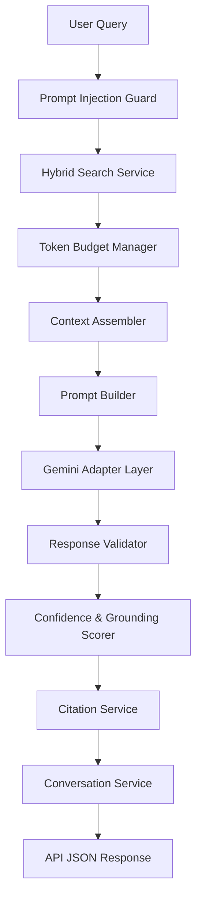
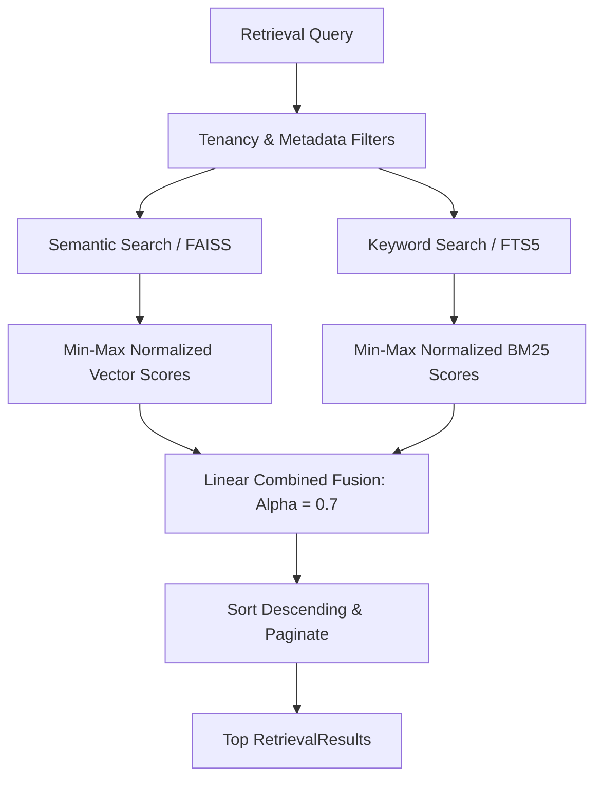

# AI Subsystem & RAG Architecture Documentation

This document serves as the canonical reference for the AI and Retrieval-Augmented Generation (RAG) subsystem of EquityIQ. It details the design, pipeline lifecycle, safety boundaries, and isolation policies governing intelligent assistant operations.

---

## 1. Guiding Principle: "Determinism Before Intelligence"

EquityIQ's AI system enforces a strict operational separation:
- **Deterministic Engines** perform all computations, financial calculations, ratio checks, document parsing, and database queries.
- **The Generative LLM** acts solely as an natural-language reading, synthesis, and explanation engine. It is strictly forbidden from executing calculations, estimating missing values, or fabricating citations.

---

## 2. High-Level Architecture

The RAG subsystem is designed as a modular pipeline where each component performs a single responsibility before feeding the next.

---

## 3. The RAG Lifecycle Pipeline

### Step 1: Prompt Injection Guard
- **File**: `app/application/services/prompt_injection_guard.py`
- **Logic**: Scans raw user queries and retrieved chunk contents against a compiled set of malicious patterns. Refuses execution immediately upon detecting override attempts, instruction extractions, system role-switching, or XML tag manipulation.

### Step 2: Hybrid Retrieval
- **File**: `app/application/services/hybrid_search_service.py`
- **Logic**: Combines dense semantic vector retrieval (FAISS index using `bge-small-en-v1.5` embeddings) and sparse keyword retrieval (SQLite FTS5 index).
- **Fusion**: Normalizes similarity scores from both search paths to `[0.0, 1.0]` and merges them using a weighted linear combination:
  $$\text{Hybrid Score} = \alpha \times \text{Semantic Score} + (1 - \alpha) \times \text{Keyword Score}$$
  *(Default $\alpha = 0.70$)*

### Step 3: Token Budget Manager
- **File**: `app/application/services/token_budget_manager.py`
- **Logic**: Audits the total prompt token size against a hard limit of 20,000 tokens using local tiktoken counts. Prunes conversation history turns first (oldest first) down to a minimum configuration before dropping lower-relevance context chunks.

### Step 4: Context Assembly
- **File**: `app/application/services/context_assembler.py`
- **Logic**: Deduplicates retrieved chunks by ID and merges consecutive chunk indexes belonging to the same document section. Formats the output inside structured, XML-tagged elements containing page and document metadata.

### Step 5: Prompt Builder
- **File**: `app/application/services/prompt_builder.py`
- **Logic**: Dynamically loads external prompt markdown files (Base system prompts, Financial compliance instructions, and Citation instructions) and merges them with the assembled XML context, conversation history, and user query.

### Step 6: Gemini Provider Layer
- **File**: `app/infrastructure/llm/gemini_adapter.py`
- **Logic**: Connects to the Gemini SDK. Uses **Gemini 2.5 Pro** as the primary completion model. Automatically catches connection or rate failures to hot-swap to **Gemini 2.5 Flash** as a robust fallback. Exposes latency, input/output token counts, and fallback flags via a structured telemetry model.

### Step 7: Response Validator
- **File**: `app/application/services/response_validator.py`
- **Logic**: Re-scans the generated answer. Rejects responses containing dangling citations or numeric values not directly supported by cited context segments.

### Step 8: Confidence & Grounding Scoring
- **File**: `app/application/services/confidence_scorer.py`
- **Logic**: Calculates two deterministic scores:
  - **Confidence Score**: Compiles a weighted average $[0.0 - 1.0]$ based on maximum vector similarity (30%), citation density (30%), coverage quantity (20%), and source document agreement (20%).
  - **Grounding Score**: Measures the exact sentence-level citation ratio. Returns:
    $$\text{Grounding Score} = \frac{\text{Number of Cited Sentences}}{\text{Total Sentences}}$$

### Step 9: Citation Generation
- **File**: `app/application/services/citation_service.py`
- **Logic**: Identifies inline citation tags `[Chunk X]` in the response text, matches them to the corresponding merged context block, and populates comprehensive explainability records.

### Step 10: Conversation Memory
- **File**: `app/application/services/conversation_service.py`
- **Logic**: Saves chat turns to the database. Triggers an async background task to summarize oldest message turns and update the conversation session's summary memory block, soft-deleting individual turns if messages exceed 10 active turns.

---

## 4. Security & Tenant Isolation

1. **Workspace Tenancy**: All retrieval, search, conversation, and telemetry lookups strictly filter by `workspace_id`.
2. **Untrusted Context**: Prompt templates wrap retrieved context inside XML tags with instructions instructing the model to treat context as untrusted data, mitigating prompt injection vulnerability.

---

## 5. Extensibility & Future Features

### Provider Abstraction
All LLM actions are mapped through the `LLMProvider` protocol interface, allowing clean integration of additional providers (OpenAI, Anthropic, or Ollama local nodes) by implementing standard provider methods.

### Streaming
The architecture supports future token-level streaming by introducing async generator generators inside the `LLMProvider` protocol and propagating chunks up to FastAPI `StreamingResponse` routers.
